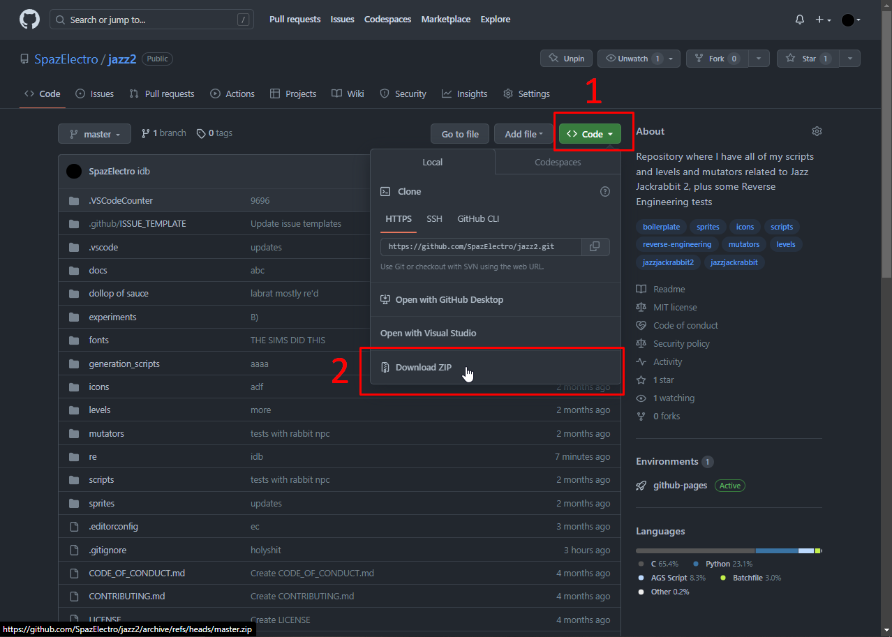

# The easiest way(s) to run your JJ2+ scripts!

First steps first, let's start by making your development folder, Create a new folder, name it whatever you want, I use/prefer `jazz2`, create 3 new folders, `levels`, `mutators` and `scripts` (this will be used later on for advanced stuff), now you can follow these simple steps on how to create scripted levels and mutators fast:

* Alright, first off, you'll need [Python 3](https://www.python.org) (and a Windows machine to play test)
* Clone [this repo](https://github.com/SpazElectro/jazz2), You can clone it by clicking on `Code` and then `Download ZIP`

* Open the folder and copy: `create_new.py`,`empty.j2l` and now paste that into your development folder
* Create a new file, called: `run.ini`, and make it follow this format, and replace the values with your own, so for my game installation at `F:\Games\Jazz2`, I would have this:
```ini
GAME_DIRECTORY=F:\Games\Jazz2\
GAME_NAME=Jazz2.exe
```
* Run `create_new.py` and make an example mutator, let's call it ~~`babysfirst`~~ `mansfirst`, make sure that your (mutator/level)'s name doesn't have any: spaces, special characters/unicode

Congratulations, You've now created a mutator! but let's start it first to make sure everything is set up correctly, thankfully starting the mutator is very easy!

* Go to the `mutators` folder, you should see a folder inside with your mutator's name
* Run the `run.bat` file inside of the mutator's folder, Congratulations once again, Your mutator is working!

# FAQ
## JJ2 doesn't run when I run the `run.bat` file!
If JJ2 doesn't run when you run the `run.bat` file, go to the mutator's folder and click on the ***empty*** space at the title bar and type in `cmd .` and press enter

<br><br>
The command prompt should open, now type in `run.bat` and press enter in the command prompt, if you get "The system cannot find the file specified."
<br><br>
That means that your config (`run.ini`) file is not at the development folder, Make sure your `run.ini` file is there and it has the file extension `.ini` and not `.txt`

### I can't change the file extension of the config file to `.ini`
Go to your development folder, and follow as below:


After that, you can rename your folder to have `.ini` instead of `.txt`, and everything (hopefully) will work just fine

### JJ2 opens and crashes whenever I run `run.bat`
This means you do not have JJ2+, For this to work, you MUST get the JJ2+ patch, it is available for free at [this site](https://jj2.plus)

### Else:
If your CMD looks something like below, that means the Jazz2 folder in the config is invalid, try rechecking it, also make sure to add a backslash at the end
```
Copying files...
../../scripts/\STVinteract.asc
The system cannot find the path specified.
../../scripts/\STVmenu.asc
The system cannot find the path specified.
../../scripts/\STVprogress.asc
The system cannot find the path specified.
../../scripts/\STVutil.asc
The system cannot find the path specified.
../../scripts/\STVutilminus.asc
The system cannot find the path specified.
../../scripts/\STVwinui.asc
The system cannot find the path specified.
../../scripts/\WinUI_ColorsPAL.png
The system cannot find the path specified.
../../scripts/\WinUI_GenericPAL.png
The system cannot find the path specified.
        0 file(s) copied.
The system cannot find the path specified.
        0 file(s) copied.
Starting
The system cannot find the path specified.
```
